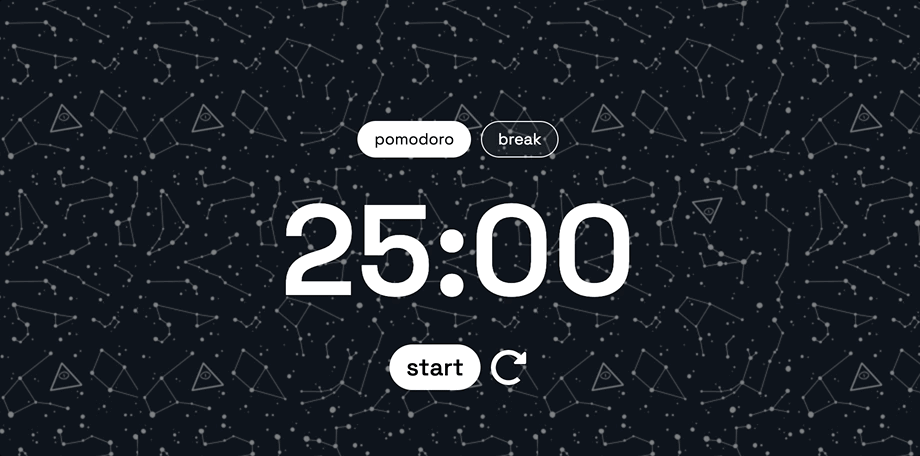
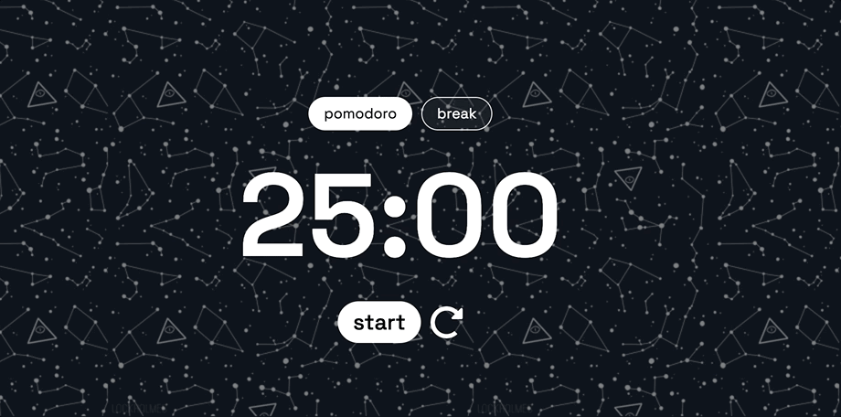

# Домашнее задание к модулю "Продвинутая работа с функциями"

Слышала о таймере Pomodoro 🍅? А, может, даже пользовалась? Если нет, можешь почитать о нем [тут](https://lifehacker.ru/special/pomodoro/).

В качестве домашнего задания тебе предстоит разработать нечто подобное. Верстка уже готова, но если хочешь, можешь поменять дизайн на свой вкус.

Задание разделено на два уровня сложности. Первый обязателен для выполнения, второй — по желанию.

## Базовый уровень
Реализуй таймер обратного отсчета от 25 минут до нуля. Можешь сделать его ускоренным.

### Требования:
* при клике на кнопку **start** текст на ней меняется на **stop**
* при клике на **stop** таймер останавливается, но **не сбрасывается**, текст на кнопке снова меняется на **start**
* если снова кликнуть на кнопку, то отсчет возобновится со значения, на котором остановились
* когда таймер дойдет до нуля, он должен сброситься в начальное состояние: **25:00** и текст на кнопке снова **start**

### Демо:

## Продвинутый уровень
В дополнение к базовому уровню добавится режим отдыха **break** и кнопка сброса отсчета (рядом с кнопкой stop / start)

### Требования:
* при переключении между режимами меняется время: **25:00** для pomodoro и **05:00** для break
* при нажатии на кнопку сброса должно устанавливаться **начальное значение** таймера в зависимости от выбранного режима
* переключение между режимами и кнопка сброса **останавливают** таймер (то есть отсчет должен заморозиться), даже если действие выполнено во время работы таймера

### Демо:

